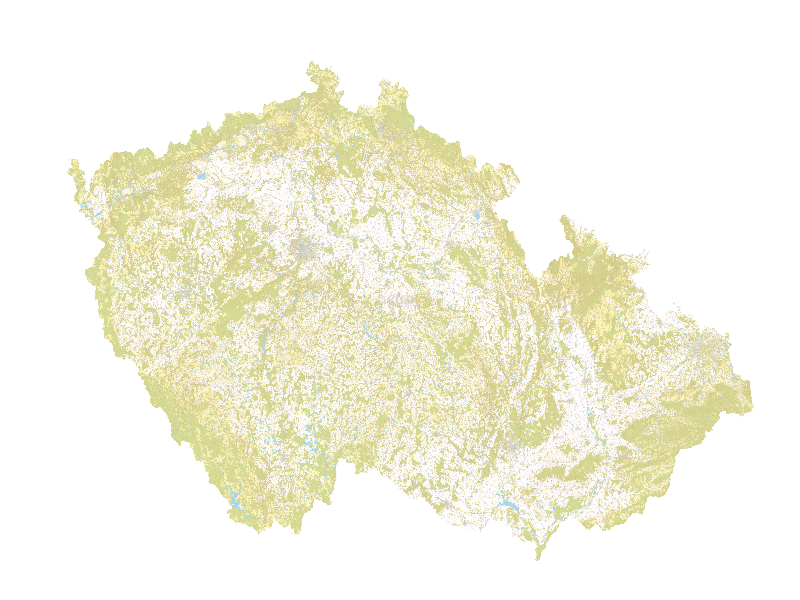

Interaction with OGC OWS from Python
====================================

:wikipedia-en:`Open Geospatial Consortium` (OGC) is international
standard organisation. It's members are developing and maintaining
standards for geospatial data and web services. Among most known
standards belongs format :wikipedia-en:`Geography Markup Language`
(GML), :wikipedia-en:`Keyhole Markup Language` (KML) and so called
open web services (OGC OWS), which includes :wikipedia-en:`Web Map
Service` (OGC WMS), :wikipedia-en:`Web Feature Service` (OGC WFS),
:wikipedia-en:`Web Coverage Service` (OGC WCS) and others.

OGC OWS defines communication between server and client, where client
(your computer) is sending requests to the server (computer, where are
the data and you can access them throu the service).  Server is
responding usually with :wikipedia-en:`XML` file. Request has usually
form of URL with input parameters separated with ``&`` mark, for
example::

    http://server/service/request=GetCapabilies&service=WMS

In this case, two parameters are part of the request: request with
value `GetCapabilities` and service with value `WMS`. Another option
usually is, to send the request in form of XML file via HTTP POST
interface of the server, for example::

        <wps:GetCapabilities xmlns:wps="http://www.opengis.net/wps/1.0.0" ...>
             <ows:Identifier>Buffer</ows:Identifier>
        </wps:Execute>

Forming requests and parsing response from various server
implementations and standards could be tricky. Therefore **OWSLib
library** was written, which makes life of coders easier.

OWSLib
------

`OWSlib library <http://geopython.github.io/OWSLib>`__ is interface
from the Python language for OGC OWS. The library enables you to
connect to the services as client. Currently supporting WMS, WFS, WCS,
CSW, WPS, SOS, WMC and others (the list is growing).

Documentation: http://geopython.github.io/OWSLib/

OGC CSW
~~~~~~~

First think you need, when you want to use some web service, is to know,
where it is located. For this purpose, catalogues are build - special
services with list of available data, services and application out there
- actually list of their metadata. OGC CSW (:wikipedia-en:`Catalog
Service for the Web`) is used very much in European INSPIRE directive
and the main entry point for Czech national INSPIRE geoportal is
located at http://geoportal.gov.cz/php/micka/csw/index.php (web
interface can be found at http://inspire.gov.cz).

Let's read some metadata

.. code:: python

    >>> from owslib.csw import CatalogueServiceWeb
    >>> thecsw = CatalogueServiceWeb('http://geoportal.gov.cz/php/micka/csw/index.php')
    >>> print(thecsw.service)
    CSW

Download the records

.. code:: python

    >>> thecsw.getrecords2()
    >>> print(thecsw.results)
    {'matches': 2113, 'nextrecord': 11, 'returned': 10}

Check out some attributes of found records:

.. code:: python

    >>> for rec in thecsw.records:
    ...    print(thecsw.records[rec].title)
    Olomouc
    Olomouc
    Dálniční exity GN
    Global Network - Jednotná georeferenční síť pozemních komunikací
    Železniční přejezd GN
    Kilometráž GN
    Osa železničních tratí
    Železniční tunely
    ...

Filters
~~~~~~~

With CSW, you can use another standard of OGC: `Filter Encoding
Specification
<http://portal.opengeospatial.org/files/?artifact_id=8340>`__
(FES). Filters can use attributes or geometry. In following example,
we will define two filters: records with keyword 'WMS' and with data
covering city Prague.

.. code:: python

    >>> from owslib.fes import PropertyIsLike, BBox, And, PropertyIsEqualTo

    >>> wms_query = PropertyIsEqualTo('csw:AnyText', 'WMS')
    >>> prague_query = BBox([14.22,49.94,14.71,50.18])
    >>> prague_and_wms = And([prague_query, wms_query])

    >>> thecsw.getrecords2([prague_and_wms], esn='full')
    >>> print(thecsw.results)
    {'matches': 503, 'nextrecord': 11, 'returned': 10}

    >>> for recid in thecsw.records:
    ...    record = thecsw.records[recid]
    ...    print(u'{} {} {} {}'.format(record.title, record.bbox.minx,
    ...                                record.bbox.miny, record.bbox.maxx, record.bbox.maxy))
    Významné body železniční sítě 48.96 12.53 52.03 19.73
    ÚP VÚC Adršpach 48.20735042 11.86320935 51.37551609 19.0302868
    VÚC Hradecko-Pardubické aglomerace 48.20735042 11.86320935 51.37551609 19.0302868
    ÚP VÚC okresu Jičín 48.23303412 11.93768841 51.35407571 18.95542894
    ÚP VÚC Krkonoše 48.20735042 11.86320935 51.37551609 19.0302868

Find out attributes of metadata record:

.. code:: python

    >>> zm_query = PropertyIsEqualTo('csw:AnyText', 'ZM10') # Basic map 1:10 000 -> Základní mapa
    >>> thecsw.getrecords2([zm_query], esn='full')
    >>> zm10 = thecsw.records['CZ-CUZK-WMS-ZM10-P']

    >>> print("Service: {}".format(zm10.type))
    Service: service

    >>> print(u"Title: {}".format(zm10.title)) # View service of basic map 1:10 000
    Title: Prohlížecí služba WMS - ZM 10

    >>> print(u"Abstract: {}".format(zm10.abstract))
    Abstract: Prohlížecí služba WMS-ZM10-P je poskytována jako veř....

    >>> zm10_url = zm10.references[0]['url']
    >>> print("Service end point: {}".format(zm10_url))
    Service end point: http://geoportal.cuzk.cz/WMS_ZM10_PUB/WMService.aspx?service=WMS&request=getCapabilities

OGC WMS
~~~~~~~

OGC :wikipedia:`Web Map Service` is there for downloading rendered images of the map.

.. code:: python

    >>> from owslib.wms import WebMapService
    >>> zm10_wms = WebMapService(zm10_url)

    >>> print(u"WMS title: {}".format(zm10_wms.identification.title))
    WMS title: Prohlížecí služba WMS - ZM 10

    >>> print(u"WMS abstract: {}".format(zm10_wms.identification.abstract))
    WMS abstract: Prohlížecí služba WMS-ZM10-P je poskytována jako veřejná...

    >>> print(u"Provider name: {}".format(zm10_wms.provider.name))
    Provider name: Zeměměřický úřad

    >>> print(u"Provider address: {}".format(zm10_wms.provider.contact.address))
    Provider address: Pod Sídlištěm 9

Available WMS layers:

.. code:: python

    >>> print(zm10_wms.contents)
    OrderedDict([('GR_ZM10', <owslib.wms.ContentMetadata instance at 0x7fe998ffa5f0>)])

    >>> print(zm10_wms.contents['GR_ZM10'].boundingBox)
    (4140810.2458188343, 2430107.864950398, 4619998.407921888, 2713834.6510789962, 'EPSG:3034')

    >>> print(zm10_wms.contents['GR_ZM10'].boundingBoxWGS84)
    (12.048389608939377, 48.472627831409234, 18.88669737853874, 51.0843904830119)

Download and save the data (image)

.. code:: python

    >>> img = zm10_wms.getmap(layers=['GR_ZM10'],
    ...    size=[800, 600],
    ...    srs="EPSG:5514",
    ...    bbox=[-950003.175021186, -1250003.1750036045, -399990.474995786, -899996.8249909044],
    ...    format="image/png")

    >>> out = open('zm10.png', 'w')
    >>> out.write(img.read())
    >>> out.close()

   Downloaded image from WMS

OGC WFS
~~~~~~~

OGC :wikipedia-en:`Web Feature Service` deals for downloading of
vector data. Usually OGC GML format is used for data exchange.

First step: let's find some WFS service in our CSW server:

.. code:: python

    >>> wfs_query = PropertyIsLike('csw:AnyText', 'WFS')
    >>> aopk_query = PropertyIsLike('csw:AnyText', 'AOPK') # Land conservation agency
    >>> service_query = PropertyIsLike('apiso:type', 'service')
    >>> aopk_and_wfs = And([aopk_query, wfs_query, service_query])
    >>> thecsw.getrecords2([aopk_and_wfs], esn='full')

    >>> print(thecsw.results)
    {'matches': 6, 'nextrecord': 0, 'returned': 6}

    >>> for recid in thecsw.records:
    ...     record = thecsw.records[recid]
    ...     print(u"{} {}".format(recid, record.title))
    53e37222-89a0-472b-9781-5bfc0a02080a WFS Soustava území Natura 2000
    53e37cd6-5cb8-4ee9-b862-62e10a02080a WFS Památné stromy
    5473579f-fb08-48ab-893d-3d3e0a02080a WFS Chráněná území
    54735935-a88c-4c58-99bc-3dee0a02080a WFS Mezinárodní ochrana přírody
    53e47f1f-1bb8-405f-9254-514a0a02080a WFS Údaje o území
    53f3708e-9d1c-4da6-983c-086e0a02080a WFS Průchodnost krajiny pro velké savce

Let's have a look at WFS data in Nature Conservation Agency of the Czech
Republic:

.. code:: python

    >>> natura = thecsw.records['53e37222-89a0-472b-9781-5bfc0a02080a']
    >>> print(u"Abstract:\n {}\n".format(natura.abstract))
    Abstract:
         Služba zpřístupňuje geografická data soustavy území Natura 2000 v České republice; (c) AOPK ČR

    >>> print(u"Identifier: {}".format(natura.identifiers[1]['identifier']))
    Identifier: http://gis.nature.cz/arcgis/services/UzemniOchrana/Natura2000/MapServer/WFSServer?service=WFS&request=GetCapabilities&version=1.1.0

Let's read some data

.. code:: python

    >>> from owslib import wfs as webfeatureservice
    >>> url = natura.identifiers[1]['identifier']
    >>> aopk = webfeatureservice.WebFeatureService('http://gis.nature.cz/arcgis/services/UzemniOchrana/Natura2000/MapServer/WFSServer')

Let's checkout service Capabilities (metadata)

.. note:: This is, how it looks, when character encoding do not fit...

.. code:: python

    >>> capabilities = aopk.getcapabilities()
    >>> print("URL: {}".format(capabilities.geturl()))
    URL: http://gis.nature.cz/arcgis/services/UzemniOchrana/Natura2000/MapServer/WFSServer?service=

    >>> print("Name: {}".format(aopk.provider.name))
    Name: Natura2000

    >>> print(u"Title: {}".format(aopk.identification.title))
    Title: Soustava chrá...

    >>> print(u"Keywords: {}".format(aopk.identification.keywords[0]))
    Keywords: Natura 2000, Chráněné území

    >>> print(u"Fees: {}".format(aopk.identification.fees))
    Fees: žádné

    >>> print(u"Abstract: {}".format(aopk.identification.abstract))
    Abstract: Služba zpřístup

Metadata attributes of the service

.. code:: python

    >>> for rec in aopk.contents:
    ...     print(rec)

    Natura2000:Forma_ochrany_EVL_-_stav_k_NV_73_2016__3._2._2016_
    Natura2000:Evropsky_významná_lokalita__EVL_

Get the data now

.. code:: python

    >>> identifier = 'UzemniOchrana_Natura2000:Evropsky_významná_lokalita__EVL_'
    >>> features = aopk.getfeature([identifier])
    >>> print(features)
    <owslib.util.ResponseWrapper object at 0x7fe9988f93d0>

Print the XML nicely

.. code:: python

    >>> print(features.read())
    <wfs:FeatureCollection xsi:schemaLocation='https://gis.nature.cz/arcgis/services...'
    ...

State Administration of Land Surveying and Cadastre WFS service
~~~~~~~~~~~~~~~~~~~~~~~~~~~~~~~~~~~~~~~~~~~~~~~~~~~~~~~~~~~~~~~

Another example: :wikipedia-en:`NUTS3` regions from the official WFS
server of State Administration of Land Surveying and Cadastre

.. code:: python

    >>> cuzk = webfeatureservice.WebFeatureService('http://geoportal.cuzk.cz/wfs_au/wfservice.aspx', version="2.0.0")
    >>> for c in cuzk.contents: print c
    gmgml:OKRES
    gmgml:KRAJ
    gmgml:OBLAST
    gmgml:MC
    gmgml:OPU
    gmgml:KU
    gmgml:ZSJ
    gmgml:SO
    gmgml:STAT
    gmgml:ORP
    gmgml:OBEC
    >>>

    >>> nuts3 = cuzk.getfeature(typename=['gmgml:KRAJ'])
    >>> nuts3.read()

.. note:: Seems to be currenly broken, see ``Mandatory parameter
          \'TypeNames\' missing``.
