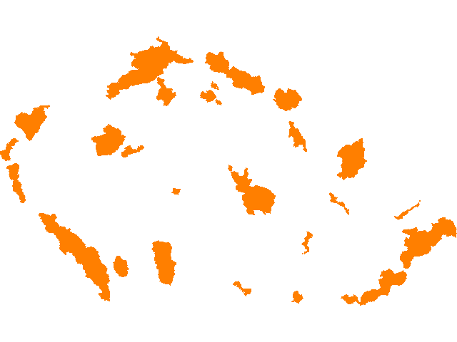

GDAL
====

GDAL library is fundamental of most open source GIS projects (which are
not living in Java programming language domain). GDAL enables the work
with raster data (and part of GDAL distribution is always OGR for vector
data). Currently, GDAL supports about 130 different raster data formats.

The concept of raster data is similar to vector data:

Driver - the data format driver DataSource - actual source, from which
you can read or to which you can save the data RasterBand - one color
band. By some sources, only one band is available. Sometimes there are
many (e.g. by hyperspectral raster data)

.. aafig::
    :aspect: 70
    :scale: 100
    :proportional:
    :textual:

                                               +------------+
                                               |            |
                                          +--->+ RasterBand |
                                         /     |            |
                                        /      +------------+
                                       /
    +--------+         +------------+ /        +------------+
    |        |         |            |/         |            |
    | Driver +-------->+ DataSource +--------->+ RasterBand |
    |        |         |            |\         |            |
    +--------+         +------------+ \        +------------+
                                       \       
                                        \      +------------+
                                         \     |            |
                                          +--->+ ...        |
                                               |            |
                                               +------------+

More information about GDAL abstract model of raster data is to be found
at http://gdal.org/gdal_datamodel.html

Among importat raster file characteristics belongs resolution (pixel
size in map units) and it's bounding box coordinates.

Example: Creating new raster file from matrix values
----------------------------------------------------

In this example, we create empty raster file and fill it with matrix of
values. Result will be stored into the file in GeoTIFF format.

First, few values have to be set - matrix size (pixel size), NODATA
value, name of the file and extent of the data:

.. code:: python

    >>> from osgeo import gdal, ogr, osr

    >>> pixel_size = 20
    >>> NoData_value = -9999
    
    >>> raster_fn = 'data/test.tif'
    >>> x_min, x_max, y_min, y_max = (0, 100, 0, 100)

In the next step, we will calculate spatial resolution (pixel size):

.. code:: python

    >>> x_res = int((x_max - x_min) / pixel_size)
    >>> y_res = int((y_max - y_min) / pixel_size)

Now new data source for raster data can be created. First we have to
create instance of Driver object for desired format and then we create
empty file. For this, we have to specify

-  file name
-  resolution in x and y direction
-  number of bands
-  data type

Then transformation parameters similar to content of the World File has
to be set

-  coordinate of left-upper corner X
-  x-resolution
-  rotation in x direction
-  coordiante of left-upper corner Y
-  y-resolution
-  rotation in y direction

.. code:: python

    >>> target_driver = gdal.GetDriverByName('GTiff')
    >>> target_ds = target_driver.Create(raster_fn, x_res, y_res, 1, gdal.GDT_Byte)
    >>> target_ds.SetGeoTransform((x_min, pixel_size, 0, y_max, 0, -pixel_size))

In the next step, we write data to selected band (first band has index
of 1 and not 0). You can write data in the NumPy matrix format.

.. code:: python

    >>> band = target_ds.GetRasterBand(1)
    
    >>> import numpy as np
    >>> band.WriteArray(np.array([[0, 0, 0, 0, 0],
    ...               [0, 10, 15, 10, 0],
    ...               [0, 15, 25, 15, 0],
    ...               [0, 10, 15, 10, 0],
    ...               [0, 0, 0, 0, 0]]))

In the next step, we define coordinate reference system. For this,
Well-known-text (WKT) format has to be used. Based on it's EPSG code,
the WKT format you get like this:

.. code:: python

    >>> outRasterSRS = osr.SpatialReference()
    >>> outRasterSRS.ImportFromEPSG(3857)
    >>> target_ds.SetProjection(outRasterSRS.ExportToWkt()) # !!! different to vector data

And at the end, you should always clean the cache to make sure, all the
data are written to hard drive (yes, here is the C++ world wawing at us)

.. code:: python

    >>> band.FlushCache()

Rasterization of vector data
----------------------------

Next desired operation could be transforamtion from vector data to
raster data representation. The beginning is similar as in the example
above:

.. code:: python

    >>> from osgeo import gdal, ogr, osr
    
    >>> # pixel resolution
    >>> pixel_size = 50
    >>> NoData_value = -9999
    
    >>> # resulting file name
    >>> raster_fn = 'data/protected_areas.tif'

Let's open vector data source

.. code:: python

    >>> vector_fn = 'data/protected_areas-etrs.shp'
    
    >>> # open the data source
    >>> source_ds = ogr.Open(vector_fn)
    
    >>> # get vector layer
    >>> source_layer = source_ds.GetLayer()

Now we can find out desired extent of input vector data and use it for
resulting raster data creation

.. code:: python

    >>> # get the bounding box
    >>> x_min, x_max, y_min, y_max = source_layer.GetExtent()
    
    >>> # create resulting data source
    >>> x_n = int((x_max - x_min) / pixel_size) # number of pixels
    >>> y_n = int((y_max - y_min) / pixel_size)
    >>> tiff_driver = gdal.GetDriverByName('GTiff')
    
    >>> # 3 bands will be used
    >>> target_ds = tiff_driver.Create(raster_fn, x_n, y_n, 3, gdal.GDT_Byte)
    >>> target_ds.SetGeoTransform((x_min, pixel_size, 0, y_max, 0, -pixel_size))

Let's copy information about coordinate reference system (S-JTSK
EPSG:3035) from the source to target data source:

.. code:: python

    >>> outRasterSRS = osr.SpatialReference()
    >>> outRasterSRS.ImportFromEPSG(3035)
    >>> target_ds.SetProjection(outRasterSRS.ExportToWkt()) # again, this is different to vectors

Now we are able to call RasterizeLayer() function with following
parameters:

-  target data source
-  raster bands
-  source data source
-  pixel values for given bands
-  aditional parameters

.. code:: python

    >>> gdal.RasterizeLayer(target_ds,
    ... [1, 2, 3],
    ... source_layer,
    ... burn_values=[255,125,0],
    ... options=['ALL_TOUCHED=TRUE']) # no spaces around '='

and clean the memory again

.. code:: python

    >>> target_ds.FlushCache()

   GDAL RasterizeLayer

