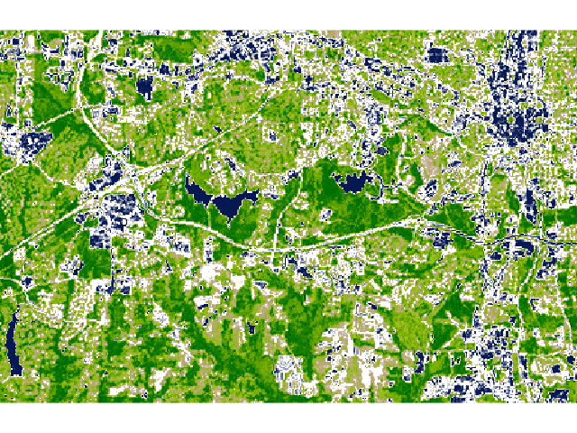

RasterIO
========

RasterIO library is another work of Sean Gillies, this time as one of
the results of his activities in MapBox. RasterIO deals with raster
geographic datasets.

RasterIO converts the data to NumPy structures (similar to Fiona, which
converts vectors to GeoJSON structure).

In following example, we will open GeoTIFF file

.. code:: python

    >>> import rasterio
    >>> src = rasterio.open('data/lsat7_2002_nir.tiff')

    # print metadata
    >>> print(src.bounds)
    BoundingBox(left=630540.0, bottom=218670.0, right=643410.0, top=226980.0)

    >>> print(src.crs)
    {u'lon_0': -79, u'datum': u'NAD83', u'y_0': 0, u'no_defs': True, u'proj': u'lcc', u'x_0': 609601.22, u'units': u'm', u'lat_2': 34.33333333333334, u'lat_1': 36.16666666666666, u'lat_0': 33.75}

    >>> print(src.tags())
    {u'AREA_OR_POINT': u'Area'}

    >>> print((src.width, src.height))
    (1287, 831)

    >>> print(src.res)
    (10.0, 10.0)

.. figure:: ../images/rgb.png

   RGB file

Let's read some raster bands

.. code:: python

    >>> data = src.read()
    >>> print(len(data))
    3

We can see, that there are 3 color bands in given rater file. Let's
create new file, containing NDVI (Normalized Difference Vegetation Index:

.. math::

    NDVI = (NIR - VIS) / (NIR  + VIS)

First we have to create new matrix for resulting data. Then we insert
result of the calculation to each cell.

We will be working actually with `NumPy <http://www.numpy.org/>`_ structures,
which is designed for work with large array fields.

.. code:: python

    >>> (nir, vis) = (data[0], data[1])
    >>> ndvi = (nir - vis) / (nir + vis)
    >>> print(ndvi.min())
    -0.944444

    >>> print(ndvi.max())
    0.974359

Let us now create new raster file, with LWZ compression, encoded in
float64 type. The file shall have one band and will use the GeoTIFF
format.

.. code:: python

    >>> kwargs = src.meta
    >>> kwargs.update(dtype=rasterio.float64, count=1, compress='lzw')
    >>> with rasterio.open('data/ndvi.tif', 'w', **kwargs) as dst:
    ...     dst.write_band(1, ndvi.astype(rasterio.float64))

   NDVI file

