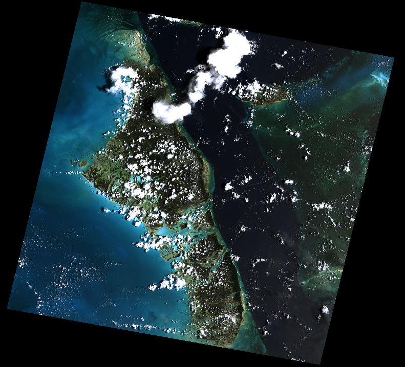
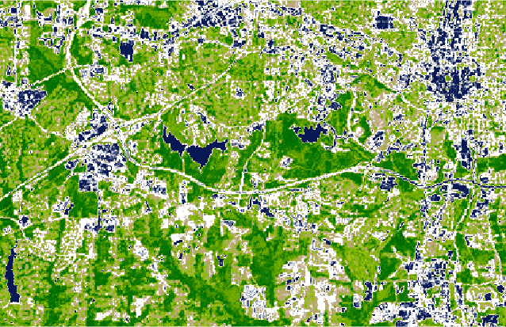

Rasterio
========

Knihovna `rasterio <https://github.com/mapbox/rasterio>`_ je opět dílo
zejména `Seana Gilliese <http://sgillies.net/>`_, tentokrát v rámci
jeho působení ve firmě `MapBox <http://mapbox.com>`_. Rasterio pracuje
s rastrovými geografickými datovými sadami. Na pozadí Rasterio pracuje
spolehlivá knihovna :doc:`gdal`.

Rasterio pracuje s objekty knihovny `NumPy <http://www.numpy.org/>`_
(podobně jako dříve zmíněná :ref:`Fiona <fiona>` pracuje s objekty
JSON). Autor tvrdí, že Rasterio se vyslovuje *[raw-STEER-ee-oh]* a
měla by práci s rastrovými daty udělat více zábavnou a produktivnější.

V následujícím příkladu otevřenem rastrový soubor ve formátu
:wikipedia-en:`GeoTIFF` a podíváme se na některá metadata:

.. code-block:: python

    >>> import rasterio
    >>> src = rasterio.open('lsat7_2002_nir.tiff')
    >>> src.bounds
    BoundingBox(left=596670.0, bottom=185000.0, right=678330.0, top=258500.0)
    >>> src.crs
        {u'lon_0': -79, u'datum': u'NAD83', u'y_0': 0, u'no_defs': True, u'proj': u'lcc', u'x_0': 609601.22,
         u'units': u'm', u'lat_2': 34.33333333333334, u'lat_1': 36.16666666666666, u'lat_0': 33.75}
    >>> # tagy formátu GeoTIFF
    >>> src.tags()
    {u'AREA_OR_POINT': u'Area'}
    >>> src.width, src.height
    (1287, 831)
    >>> src.res
    (10.0, 10.0)

    Výsledný soubor s NDVI indexem

Načtení barevných kanálů:

.. code-block:: python

    >>> data = src.read()
    >>> len(data)
    3

Vidíme, že v rastru jsou obsaženy tři barevné kanály. Vytvoříme nyní nový
soubor, obsahující pokus o index NDVI.

.. note:: :wikipedia-en:`Normalizovaný vegetační index
    <Normalized_Difference_Vegetation_Index>` je poměr mezi viditelným
    červeným kanálem a blízkým infračerveným kanálem satelitních dat.

    .. math::
        
         NDVI = (NIR - VIS) / (NIR  + VIS)

Neprve vytvoříme novou matici pro výsledné hodnoty, následně do tohoto pole uložíme
výsledek výpočtu pro každý pixel. Pracujeme vlastně v prostředí NumPy, které
práci s poli významně usnadňuje.

.. code-block:: python

    >>> (nir, vis) = (data[0], data[1])
    >>> ndvi = (nir - vis) / (nir + vis)
    >>> ndvi.min()
    -0.94444442
    >>> ndvi.max()
    0.97435898

Výsledek uložíme do nově vytvořeného souboru. Data budou zkomprimována pomocí
LWZ komprese a uložena v číselném formátu `float64` (mapa obsahuje čísla s
plovoucí desetinnou čárkou a negativní hodnoty). Výsledný soubor ve formátu GeoTIFF bude mít pouze jeden kanál.

.. code-block:: python

    >>> kwargs = src.meta
    >>> kwargs.update(dtype=rasterio.float64, count=1, compress='lzw')
    >>> with rasterio.open('ndvi.tif', 'w', **kwargs) as dst:
    ...    dst.write_band(1, ndvi.astype(rasterio.float64))

    
    Výsledný soubor s NDVI indexem
